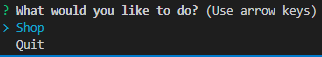
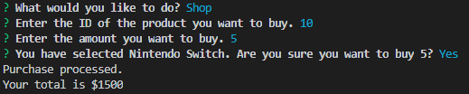
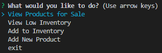
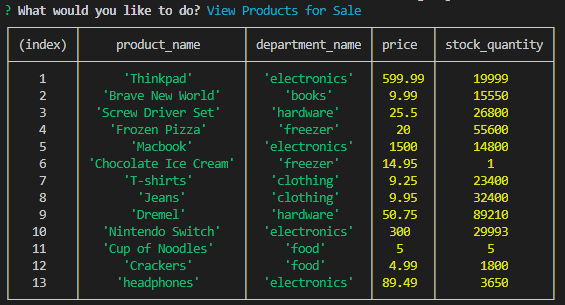
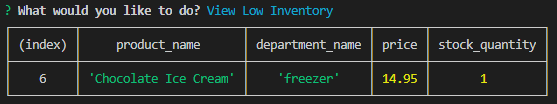
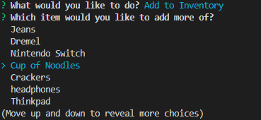
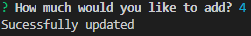
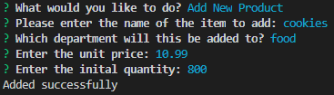

# bamazon

## About
This app comes with 2 programs: ```bamazonCustomer ``` and ```bamazonManager```. 
- ```bamazonCustomer``` allows you to buy items from the database.
- ```bamazonManager``` allows you to manage items in the database

## Installation
```
$ git clone git@github.com:mputterf/bamazon.git 
$ cd bamazon
$ npm install
```

Next, create a file called `.env` inside the `bamazon` directory.  
Inside the file, you will put your for your MySQL database like so:
```
DB_PASSWD=<YOUR_PASSWORD_HERE>
```

## Usage
```
$ node bamazonCustomer 
```
or
```
$ node bamazonCustomer
```

## bamazonCustomer
Proceed to shop or quit the program



### Shop
You will take you through the process of purchasing an item. Fill out the ID of the item and how may you would like to buy. You will be shown the total when you checkout.



### Quit
Quits the program

## bamazonManager
Manage the items for sale. You can view and add items



### View Products for Sale



### View Low Inventory
View items with a quantity less than 5



### Add to Inventory
Select the item you would like to add more stock of.





### Add New Product
Add a new item to the database



### exit
Quits the program